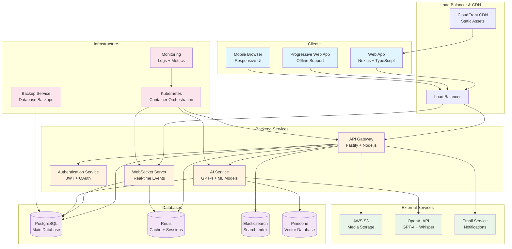
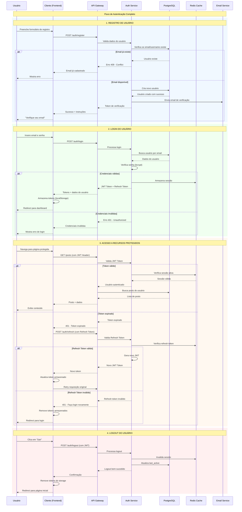
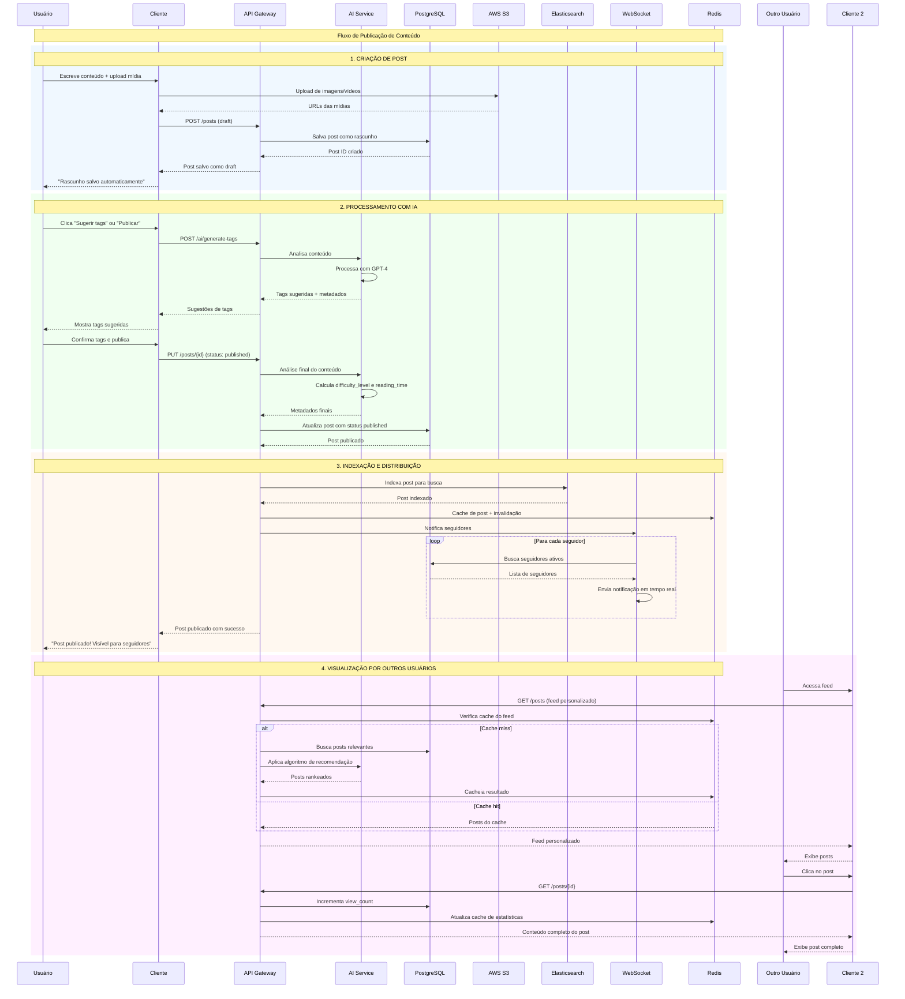
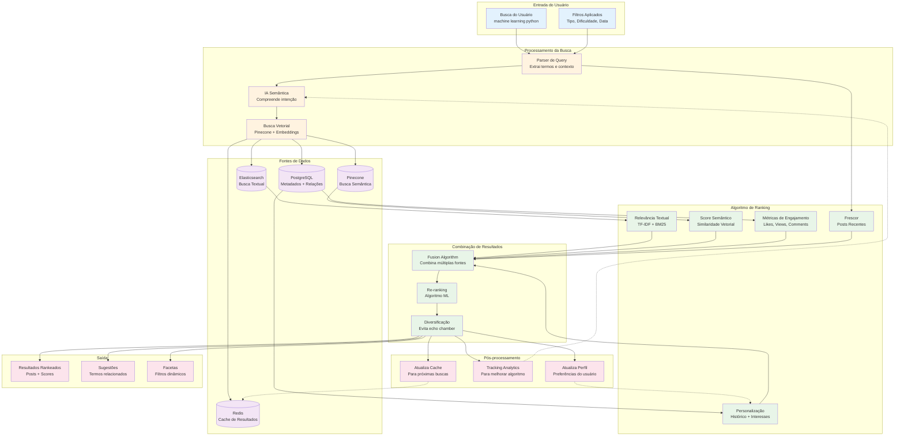
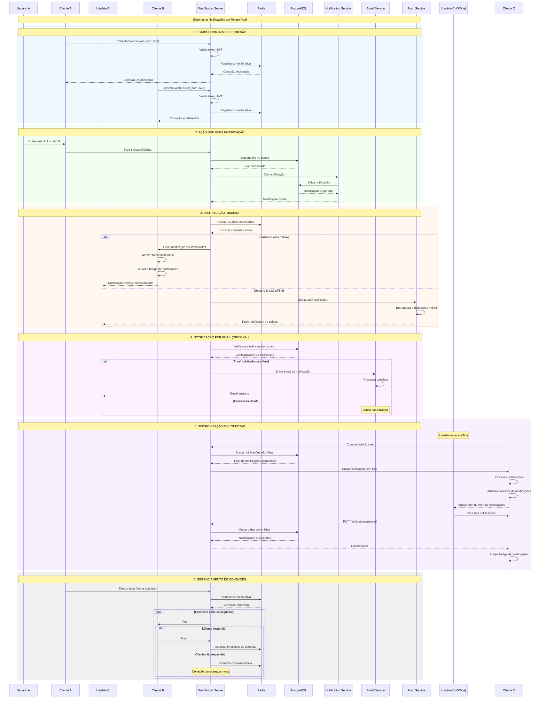
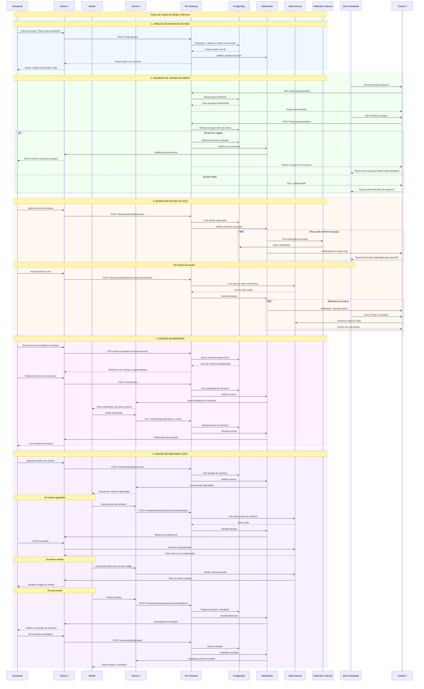

# Diagramas de Sistema - ThatEasy

Este documento contém todos os diagramas de arquitetura e fluxos do sistema da rede social educacional ThatEasy.

## 📋 Índice

1. [Arquitetura Geral do Sistema](#1-arquitetura-geral-do-sistema)
2. [Fluxo de Autenticação](#2-fluxo-de-autenticação)
3. [Fluxo de Publicação de Conteúdo](#3-fluxo-de-publicação-de-conteúdo)
4. [Fluxo de Interações Sociais](#4-fluxo-de-interações-sociais)
5. [Sistema de Busca e Recomendações](#5-sistema-de-busca-e-recomendações)
6. [Notificações em Tempo Real](#6-notificações-em-tempo-real)
7. [Sistema de Gamificação](#7-sistema-de-gamificação)
8. [Grupos de Estudo e Mentoria](#8-grupos-de-estudo-e-mentoria)

---

## 1. Arquitetura Geral do Sistema

Este diagrama mostra a visão macro de todos os componentes do ThatEasy, incluindo cliente, backend, bancos de dados e serviços externos.

**Componentes principais:**
- **Frontend**: Next.js PWA com TypeScript
- **Backend**: Microserviços com Fastify
- **Dados**: PostgreSQL, Redis, Elasticsearch, Pinecone
- **IA**: OpenAI GPT-4 integrado
- **Infraestrutura**: Kubernetes + AWS

---

## 2. Fluxo de Autenticação

Fluxo completo de registro, login, acesso a recursos protegidos e logout.

**Características:**
- JWT + Refresh Token para segurança
- Sessões no Redis para performance
- Email de verificação obrigatório
- Refresh automático de tokens

---

## 3. Fluxo de Publicação de Conteúdo

Como funciona a criação, processamento com IA e distribuição de posts na plataforma.

**Funcionalidades:**
- Auto-save de rascunhos
- IA para sugestão de tags e metadados
- Upload para S3 com CDN
- Indexação automática para busca
- Feed personalizado com ML

---

## 4. Fluxo de Interações Sociais

Sistema completo de likes, comentários, follows, compartilhamentos e bookmarks.

```mermaid
sequenceDiagram
    participant U as Usuário
    participant C as Cliente
    participant API as API Gateway
    participant DB as PostgreSQL
    participant WS as WebSocket
    participant REDIS as Redis
    participant NOTIF as Notification Service

    Note over U,NOTIF: Fluxo de Interações Sociais

    %% Like em post
    rect rgb(240, 248, 255)
        Note over U,NOTIF: 1. CURTIR POST
        U->>C: Clica no botão "curtir"
        C->>API: POST /posts/{id}/like
        API->>DB: Verifica se já curtiu
        alt Primeira vez curtindo
            API->>DB: Insere like + incrementa like_count
            DB-->>API: Like registrado
            API->>REDIS: Atualiza cache de estatísticas
            API->>WS: Notifica autor do post
            WS->>NOTIF: Cria notificação
            NOTIF->>DB: Salva notificação
            WS->>WS: Envia notificação em tempo real
            API-->>C: Like confirmado
            C->>C: Atualiza UI (botão ativo)
            C-->>U: Feedback visual imediato
        else Já curtiu (descurtir)
            API->>DB: Remove like + decrementa count
            DB-->>API: Like removido
            API->>REDIS: Atualiza cache
            API-->>C: Like removido
            C->>C: Atualiza UI (botão inativo)
        end
    end

    %% Comentário
    rect rgb(240, 255, 240)
        Note over U,NOTIF: 2. COMENTAR POST
        U->>C: Escreve comentário
        C->>API: POST /posts/{id}/comments
        API->>DB: Salva comentário + incrementa comment_count
        DB-->>API: Comentário salvo
        API->>REDIS: Invalida cache de comentários
        API->>WS: Notifica autor e mencionados
        
        loop Para menções no comentário
            WS->>NOTIF: Cria notificação de menção
            NOTIF->>DB: Salva notificação
            WS->>WS: Envia notificação real-time
        end
        
        API-->>C: Comentário publicado
        C->>C: Adiciona comentário à lista
        C-->>U: Comentário visível imediatamente
    end

    %% Seguir usuário
    rect rgb(255, 248, 240)
        Note over U,NOTIF: 3. SEGUIR USUÁRIO
        U->>C: Clica "Seguir" no perfil
        C->>API: POST /users/{username}/follow
        API->>DB: Verifica se já segue
        alt Não segue ainda
            API->>DB: Insere follow + atualiza contadores
            DB-->>API: Follow registrado
            API->>REDIS: Atualiza cache de relacionamentos
            API->>WS: Notifica usuário seguido
            WS->>NOTIF: Cria notificação de novo seguidor
            NOTIF->>DB: Salva notificação
            WS->>WS: Envia notificação em tempo real
            API-->>C: Agora seguindo
            C->>C: Atualiza botão para "Seguindo"
            C-->>U: "Agora você segue @username"
        else Já segue (deixar de seguir)
            API->>DB: Remove follow + atualiza contadores
            DB-->>API: Unfollow confirmado
            API->>REDIS: Atualiza cache
            API-->>C: Deixou de seguir
            C->>C: Atualiza botão para "Seguir"
        end
    end

    %% Compartilhamento
    rect rgb(255, 240, 255)
        Note over U,NOTIF: 4. COMPARTILHAR POST
        U->>C: Clica "Compartilhar"
        C->>C: Abre modal de compartilhamento
        U->>C: Escolhe plataforma ou compartilhamento interno
        
        alt Compartilhamento interno
            C->>API: POST /posts/{id}/share
            API->>DB: Incrementa share_count
            API->>DB: Cria post de compartilhamento
            DB-->>API: Compartilhamento registrado
            API->>WS: Notifica autor original
            WS->>NOTIF: Cria notificação de compartilhamento
            NOTIF->>DB: Salva notificação
            API-->>C: Compartilhado com sucesso
            C-->>U: "Post compartilhado no seu feed"
        else Compartilhamento externo
            C->>C: Gera link de compartilhamento
            C->>API: POST /posts/{id}/share (external)
            API->>DB: Incrementa share_count apenas
            C-->>U: Link copiado ou redirecionamento
        end
    end

    %% Bookmark/Favoritar
    rect rgb(248, 240, 255)
        Note over U,NOTIF: 5. FAVORITAR POST
        U->>C: Clica no ícone de bookmark
        C->>API: POST /posts/{id}/bookmark
        API->>DB: Verifica se já favoritou
        alt Primeira vez favoritando
            API->>DB: Insere bookmark + incrementa count
            DB-->>API: Bookmark salvo
            API->>REDIS: Atualiza cache de favoritos
            API-->>C: Post favoritado
            C->>C: Atualiza ícone (preenchido)
            C-->>U: "Salvo nos favoritos"
        else Já favoritou (remover)
            API->>DB: Remove bookmark + decrementa count
            DB-->>API: Bookmark removido
            API->>REDIS: Atualiza cache
            API-->>C: Removido dos favoritos
            C->>C: Atualiza ícone (vazio)
        end
    end
```

**Funcionalidades:**
- Feedback imediato na UI
- Notificações em tempo real
- Cache para performance
- Sistema de menções
- Contadores atualizados automaticamente

---

## 5. Sistema de Busca e Recomendações

Algoritmo inteligente que combina busca textual, semântica e personalização.

**Tecnologias:**
- Elasticsearch para busca textual
- Pinecone para busca semântica
- Machine Learning para ranking
- Cache inteligente no Redis
- Personalização baseada em comportamento

---

## 6. Notificações em Tempo Real

Sistema completo de notificações via WebSocket, push notifications e email.

**Funcionalidades:**
- WebSocket para real-time
- Push notifications para offline
- Email configurável por usuário
- Sincronização automática
- Heartbeat para conexões saudáveis

---

## 7. Sistema de Gamificação

Sistema completo de pontos, conquistas, streaks, rankings e desafios personalizados.

```mermaid
sequenceDiagram
    participant U as Usuário
    participant C as Cliente
    participant API as API Gateway
    participant GAMIF as Gamification Service
    participant DB as PostgreSQL
    participant REDIS as Redis
    participant WS as WebSocket
    participant AI as AI Service

    Note over U,AI: Sistema de Gamificação e Conquistas

    %% Ação do usuário que pode gerar pontos
    rect rgb(240, 248, 255)
        Note over U,AI: 1. AÇÃO QUE GERA PONTOS
        U->>C: Publica primeiro artigo
        C->>API: POST /posts (publish)
        API->>DB: Salva post publicado
        DB-->>API: Post criado com sucesso
        
        API->>GAMIF: Evento: first_post_published
        GAMIF->>DB: Busca conquistas relacionadas
        DB-->>GAMIF: Lista de achievements aplicáveis
        
        loop Para cada achievement
            GAMIF->>GAMIF: Verifica critério
            alt Critério atingido
                GAMIF->>DB: Registra conquista do usuário
                GAMIF->>DB: Adiciona pontos ao perfil
                GAMIF->>REDIS: Atualiza cache de pontuação
            end
        end
        
        GAMIF-->>API: Conquistas desbloqueadas
        API-->>C: Post + conquistas
        C->>C: Mostra animação de conquista
        C-->>U: "Parabéns! Conquista desbloqueada"
    end

    %% Sistema de streaks
    rect rgb(240, 255, 240)
        Note over U,AI: 2. SISTEMA DE STREAKS
        U->>C: Lê artigos durante 7 dias consecutivos
        C->>API: GET /posts/{id} (tracking de leitura)
        API->>GAMIF: Evento: article_read
        GAMIF->>DB: Atualiza streak de leitura
        
        alt Novo recorde de streak
            GAMIF->>DB: Verifica achievement de streak
            DB-->>GAMIF: "7 Day Scholar" disponível
            GAMIF->>DB: Desbloqueia conquista
            GAMIF->>WS: Notifica conquista especial
            WS->>C: Push notification
            C-->>U: "Streak de 7 dias! +500 pontos"
        else Mantém streak
            GAMIF->>REDIS: Atualiza contador diário
            GAMIF-->>API: Streak mantido
            API-->>C: Contador atualizado
        end
    end

    %% Ranking e competição
    rect rgb(255, 248, 240)
        Note over U,AI: 3. RANKINGS E COMPETIÇÃO
        U->>C: Acessa página de ranking
        C->>API: GET /rankings/weekly
        API->>REDIS: Busca cache de ranking
        
        alt Cache válido
            REDIS-->>API: Ranking da semana
        else Cache expirado
            API->>DB: Calcula ranking atual
            DB-->>API: Top usuários por pontos
            API->>REDIS: Cacheia ranking (1 hora)
        end
        
        API-->>C: Ranking + posição do usuário
        C-->>U: "Você está em #15 esta semana"
    end

    %% Desafios semanais
    rect rgb(255, 240, 255)
        Note over U,AI: 4. DESAFIOS SEMANAIS
        Note over GAMIF: Sistema gera desafios automaticamente
        GAMIF->>AI: Analisa padrão do usuário
        AI->>DB: Busca histórico de atividade
        DB-->>AI: Dados de comportamento
        AI->>AI: Gera desafio personalizado
        AI-->>GAMIF: Desafio: "Leia 5 artigos de IA"
        
        GAMIF->>DB: Cria desafio para usuário
        GAMIF->>WS: Notifica novo desafio
        WS->>C: Notificação de desafio
        C-->>U: "Novo desafio semanal disponível"
        
        U->>C: Aceita desafio
        C->>API: POST /challenges/{id}/accept
        API->>DB: Registra participação no desafio
        
        loop Durante a semana
            U->>C: Lê artigo de IA
            C->>API: Tracking de progresso
            API->>GAMIF: Progresso do desafio
            GAMIF->>DB: Atualiza progresso (2/5)
            GAMIF->>WS: Atualização em tempo real
            WS->>C: Progresso atualizado
            C-->>U: "Progresso: 2/5 artigos"
        end
        
        alt Desafio completado
            GAMIF->>DB: Marca desafio como completo
            GAMIF->>DB: Adiciona recompensa especial
            GAMIF->>WS: Conquista de desafio
            WS->>C: Celebração de conclusão
            C-->>U: "Desafio completo! +1000 pontos"
        end
    end

    %% Sistema de níveis
    rect rgb(248, 240, 255)
        Note over U,AI: 5. PROGRESSÃO DE NÍVEIS
        Note over GAMIF: Usuário acumula pontos suficientes
        GAMIF->>DB: Calcula nível atual vs pontos
        
        alt Level up detectado
            GAMIF->>DB: Atualiza nível do usuário
            GAMIF->>DB: Desbloqueia privilégios do nível
            GAMIF->>WS: Evento de level up
            WS->>C: Animação especial de level up
            C->>C: Mostra novos privilégios desbloqueados
            C-->>U: "Level 5 alcançado! Novos recursos"
        end
        
        U->>C: Visualiza perfil
        C->>API: GET /users/me/achievements
        API->>DB: Busca conquistas + estatísticas
        DB-->>API: Perfil completo de gamificação
        API-->>C: Dados de progresso
        C-->>U: Dashboard com badges, nível, pontos
    end
```

**Funcionalidades:**
- Sistema de pontos por ações
- Conquistas automáticas
- Streaks de atividade
- Rankings competitivos
- Desafios personalizados com IA
- Progressão por níveis

---

## 8. Grupos de Estudo e Mentoria

Sistema completo de colaboração educacional com grupos, sessões ao vivo e mentoria 1-on-1.

**Funcionalidades:**
- Grupos de estudo públicos e privados
- Sessões de vídeo ao vivo
- Sistema de matching mentor-mentee
- Video calls 1-on-1 com screen sharing
- Sistema de avaliação e rating
- Notificações automáticas para sessões

---

## 🎯 Resumo dos Componentes

### **Tecnologias Principais**
- **Frontend**: Next.js 14, TypeScript, PWA
- **Backend**: Node.js, Fastify, Microserviços
- **Bancos**: PostgreSQL, Redis, Elasticsearch, Pinecone
- **IA**: OpenAI GPT-4, Machine Learning
- **Real-time**: WebSocket, Push Notifications
- **Infraestrutura**: Kubernetes, AWS, Docker

### **Funcionalidades Chave**
- Sistema completo de autenticação e autorização
- Feed personalizado com algoritmo de ML
- Busca híbrida (textual + semântica)
- Interações sociais em tempo real
- Gamificação com conquistas e rankings
- Grupos de estudo colaborativos
- Sistema de mentoria P2P
- Notificações multi-canal

### **Escalabilidade e Performance**
- Cache inteligente em múltiplas camadas
- Processamento assíncrono
- CDN para assets estáticos
- Load balancing automático
- Monitoramento e observabilidade

---

**Atualizado em**: Janeiro 2024  
**Versão**: 1.0.0 