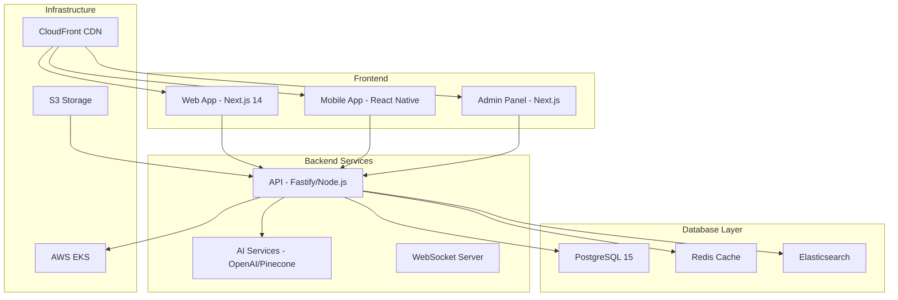

# Resumo da Stack Tecnológica - ThatEasy

## 🚀 Visão Geral da Arquitetura



## 💻 Stack Principal por Componente

### 🌐 Frontend Web
| Tecnologia | Versão | Propósito |
|------------|---------|-----------|
| **Next.js** | 14.x | Framework React com SSR/SSG |
| **TypeScript** | 5.x | Type safety e melhor DX |
| **Tailwind CSS** | 3.x | Utility-first CSS framework |
| **Shadcn/ui** | Latest | Design system components |
| **Zustand** | 4.x | State management |
| **React Query** | 5.x | Server state management |
| **Turbopack** | Latest | Build tool (Next.js 14) |

### 📱 Mobile App
| Tecnologia | Versão | Propósito |
|------------|---------|-----------|
| **React Native** | 0.73+ | Cross-platform mobile |
| **TypeScript** | 5.x | Type safety |
| **React Navigation** | 6.x | Navigation framework |
| **NativeWind** | 4.x | Tailwind for React Native |
| **Expo/EAS** | Latest | Build and deployment |
| **React Query** | 5.x | Server state management |

### 🔧 Backend API
| Tecnologia | Versão | Propósito |
|------------|---------|-----------|
| **Node.js** | 20.x | JavaScript runtime |
| **Fastify** | 4.x | High-performance web framework |
| **TypeScript** | 5.x | Type safety |
| **Prisma** | 5.x | Database ORM |
| **PostgreSQL** | 15.x | Primary database |
| **Redis** | 7.x | Caching and sessions |
| **Bull MQ** | Latest | Job queue system |

### 🤖 AI & Search
| Tecnologia | Versão | Propósito |
|------------|---------|-----------|
| **OpenAI GPT-4** | Latest | LLM for AI assistant |
| **Pinecone** | Latest | Vector database |
| **Elasticsearch** | 8.x | Full-text search |
| **TensorFlow.js** | Latest | Client-side ML |

### 🏗️ DevOps & Infrastructure
| Tecnologia | Versão | Propósito |
|------------|---------|-----------|
| **Turborepo** | Latest | Monorepo tool |
| **Docker** | Latest | Containerization |
| **Kubernetes** | 1.28+ | Container orchestration |
| **AWS EKS** | Latest | Managed Kubernetes |
| **GitHub Actions** | Latest | CI/CD pipeline |
| **Terraform** | Latest | Infrastructure as Code |

## 📊 Arquitetura de Dados

```
┌─────────────────┐    ┌─────────────────┐    ┌─────────────────┐
│   PostgreSQL    │    │      Redis      │    │ Elasticsearch   │
│                 │    │                 │    │                 │
│ • User data     │    │ • Sessions      │    │ • Content search│
│ • Posts         │    │ • Cache         │    │ • Analytics     │
│ • Relationships │    │ • Job queues    │    │ • Logs          │
│ • Transactions  │    │ • Real-time     │    │ • Metrics       │
└─────────────────┘    └─────────────────┘    └─────────────────┘
         │                       │                       │
         └───────────────────────┼───────────────────────┘
                                 │
                     ┌─────────────────┐
                     │   Fastify API   │
                     │                 │
                     │ • Business Logic│
                     │ • Authentication│
                     │ • Rate Limiting │
                     │ • WebSockets    │
                     └─────────────────┘
```

## 🔄 Fluxo de Dados

### 1. Autenticação & Autorização
```
User Login → JWT Token → Redis Session → Protected Routes
```

### 2. Content Creation
```
User Input → Validation → AI Analysis → Database → Search Index → CDN
```

### 3. Real-time Features
```
User Action → WebSocket → Event Queue → Push to Connected Clients
```

### 4. AI Assistant
```
User Query → Context Analysis → OpenAI API → Response Enhancement → User
```

## 🎯 Padrões de Desenvolvimento

### Code Structure
- **Monorepo**: Turborepo com workspaces
- **Clean Architecture**: Separation of concerns
- **Type Safety**: TypeScript em toda stack
- **API-First**: OpenAPI specification

### Testing Strategy
```
┌─────────────────┐
│  E2E Testing    │  ← Cypress (Critical user flows)
├─────────────────┤
│ Integration     │  ← API testing, DB integration
├─────────────────┤
│  Unit Testing   │  ← Jest (Business logic)
└─────────────────┘
```

### Deployment Pipeline
```
🔄 Git Push → 🧪 Tests → 🏗️ Build → 📦 Package → 🚀 Deploy
     │           │         │          │           │
     │           ├─ Lint   ├─ Docker  ├─ Registry ├─ Staging
     │           ├─ Unit   ├─ Multi   ├─ Security ├─ Production
     │           └─ E2E    └─ Arch    └─ Scan     └─ Monitoring
```

## 🔐 Segurança & Performance

### Security Measures
- **Authentication**: JWT + Refresh tokens
- **Authorization**: RBAC (Role-based access)
- **API Security**: Rate limiting, CORS, Helmet
- **Data Protection**: Encryption at rest, HTTPS
- **Compliance**: LGPD/GDPR ready

### Performance Optimizations
- **Frontend**: Code splitting, lazy loading, CDN
- **Backend**: Connection pooling, caching, indexing
- **Database**: Query optimization, read replicas
- **AI**: Response caching, request batching

## 📈 Escalabilidade

### Horizontal Scaling
```
┌─────────────────┐
│  Load Balancer  │
└─────────┬───────┘
          │
    ┌─────┴─────┐
    │           │
┌───▼───┐   ┌───▼───┐   ┌─────────┐
│API Pod│   │API Pod│   │AI Pod   │
│   1   │   │   2   │   │ (GPU)   │
└───────┘   └───────┘   └─────────┘
```

### Database Scaling
- **Read Replicas**: Para queries de leitura
- **Sharding**: Por região/tenant (futuro)
- **Caching**: Redis para hot data
- **CDN**: Assets estáticos

## 🌍 Multi-tenant Architecture (Futuro)

```
┌─────────────────┐
│ Institution A   │ ──┐
├─────────────────┤   │
│ Institution B   │ ──┤── Shared API Layer
├─────────────────┤   │
│ Institution C   │ ──┘
└─────────────────┘
         │
┌─────────▼───────────┐
│  Tenant-aware DB    │
│                     │
│ • Row-level sec     │
│ • Schema per tenant │
│ • Shared tables     │
└─────────────────────┘
```

## 🔮 Roadmap Tecnológico

### Q1 2024: MVP
- ✅ Monorepo setup
- ✅ Basic CRUD operations
- ✅ Authentication system
- ✅ Simple AI integration

### Q2 2024: Social Features
- 🔄 Real-time messaging
- 🔄 WebSocket integration
- 🔄 Push notifications
- 🔄 Mobile app MVP

### Q3 2024: AI Enhancement
- 🔄 Advanced AI features
- 🔄 Semantic search
- 🔄 Content recommendations
- 🔄 Auto-moderation

### Q4 2024: Scale & Polish
- 🔄 Performance optimization
- 🔄 Advanced analytics
- 🔄 Enterprise features
- 🔄 International expansion

## 📋 Checklist de Setup

### Development Environment
- [ ] Node.js 20+ instalado
- [ ] pnpm package manager
- [ ] Docker & Docker Compose
- [ ] PostgreSQL local
- [ ] Redis local
- [ ] VS Code + extensões TypeScript

### Project Initialization
- [ ] Clone monorepo
- [ ] Install dependencies (`pnpm install`)
- [ ] Setup environment variables
- [ ] Run database migrations
- [ ] Start development servers
- [ ] Verify all apps running

### Production Deployment
- [ ] AWS account setup
- [ ] Kubernetes cluster (EKS)
- [ ] Database provisioning (RDS)
- [ ] CDN configuration (CloudFront)
- [ ] CI/CD pipeline (GitHub Actions)
- [ ] Monitoring setup (DataDog/New Relic)

Esta documentação serve como guia técnico completo para o desenvolvimento e deploy do projeto ThatEasy, garantindo consistência e eficiência em todo o processo de desenvolvimento. 